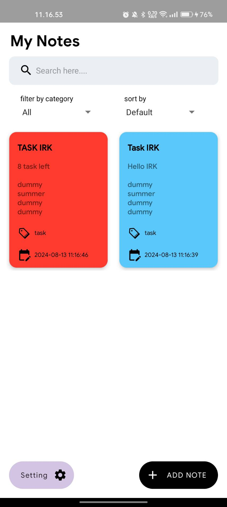
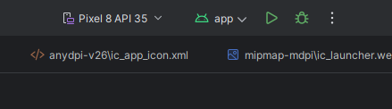
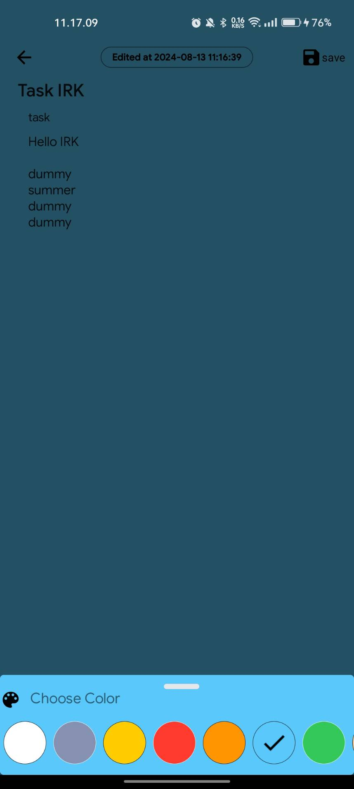
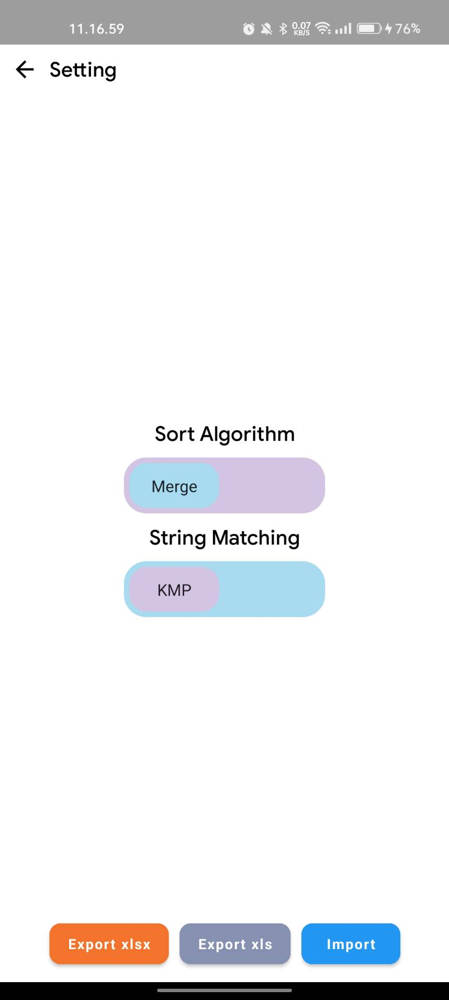

# Note APP

 
  <b>Fig 1.</b> Tampilan Home Note App
 

Note app adalah sebuah aplikasi berbasis android yang berguna untuk menyimpan catatan pengguna. Aplikasi dapat melakukan sorting, filter, dan search untuk memilih note sesuai dengan note yang diinginakan pengguna.

### How to use

Hingga saat ini untuk menggunakan aplikasi masih harus menggunakan Android Studio untuk menginstall aplikasi pada smartphone. 

Untuk saat ini, menjalankan aplikasi dapat dilakukan dengan membuka project ini menggunakan Android Studio dan menjalankan tombol run yang ada pada bagian kanan toolbar.

 
  <b>Fig 2.</b> Tombol Run pada Android Studio
 

Untuk menjalankan aplikasi ke smartphone langsung tanpa menggunakan emulator, Anda dapat melakukannya dengan menghubungkan smartphone Anda ke komputer atau device development dan mengaktifkan mode USB Debugging pada smartphone Anda. Android Studio akan secara otomatis mendeteksi perangkat smartphone Anda dan menghubungkannya.
Lebih lengkap dapat dilihat melalui [tautan ini](https://developer.android.com/studio/run/device)

### Sorting Algorithm
Algoritma Sorting yang digunakan untuk melakukan sort pada note adalah Merge Sort dan Quick Sort Algorithm. Algoritma ini dipilih karena memiliki kompleksitas waktu yang relative rendah dari algoritma sorting lainnya. Kedua algoritma ini memiliki kompleksitas waktu 
$$
O(nlogn)
$$

#### 1. Merge Sort

##### Prinsip Kerja:
- **Divide and Conquer:** Merge Sort membagi daftar menjadi dua bagian secara rekursif hingga setiap bagian hanya terdiri dari satu elemen (atau kosong). Kemudian, bagian-bagian tersebut digabungkan (merge) kembali menjadi daftar yang terurut.
- **Merging:** Saat menggabungkan dua daftar yang sudah terurut, Merge Sort memastikan bahwa hasil gabungan tetap terurut dengan membandingkan elemen dari kedua daftar.

##### Kelebihan:
- **Stabilitas:** Merge Sort adalah algoritma stabil, artinya elemen yang memiliki nilai yang sama akan tetap berada pada urutan yang sama seperti di daftar awal.
- **Waktu Terburuk:** Memiliki waktu eksekusi yang konsisten, yaitu O(n log n), pada kasus terbaik, rata-rata, dan terburuk.

##### Kekurangan:
- **Konsumsi Memori:** Membutuhkan ruang tambahan untuk menyimpan salinan dari sub-list yang sedang di-merge, sehingga penggunaan memori lebih tinggi dibandingkan Quick Sort.

##### Implementasi di Aplikasi:
- Cocok jika diperlukan kestabilan dalam pengurutan dan tidak masalah dengan penggunaan memori tambahan. Misalnya, saat menyortir catatan berdasarkan tanggal atau judul dengan urutan yang konsisten.

#### 2. Quick Sort

##### Prinsip Kerja:
- **Divide and Conquer:** Quick Sort memilih elemen pivot dan membagi daftar menjadi dua bagian: elemen yang lebih kecil dari pivot dan elemen yang lebih besar. Proses ini diulang secara rekursif untuk setiap bagian.
- **Partitioning:** Elemen di-partition di sekitar pivot sehingga elemen yang lebih kecil berada di satu sisi dan elemen yang lebih besar di sisi lainnya.

##### Kelebihan:
- **Efisiensi Memori:** Quick Sort melakukan pengurutan di tempat (in-place), yang berarti tidak memerlukan banyak memori tambahan dibandingkan Merge Sort.
- **Kecepatan:** Sering kali lebih cepat dari Merge Sort dalam praktiknya, terutama jika pivot dipilih dengan baik, dengan rata-rata waktu eksekusi O(n log n).

##### Kekurangan:
- **Stabilitas:** Quick Sort tidak stabil secara default, sehingga elemen dengan nilai yang sama mungkin tidak mempertahankan urutan aslinya.
- **Waktu Terburuk:** Pada kasus terburuk (misalnya, pivot yang buruk), waktu eksekusi bisa menjadi O(n^2), meskipun ini jarang terjadi dengan teknik pemilihan pivot yang baik (misalnya, pivot acak atau median-of-three).

##### Implementasi di Aplikasi:
- Cocok jika Anda ingin meminimalkan penggunaan memori dan dapat menerima kemungkinan ketidakstabilan dalam pengurutan. Misalnya, jika kecepatan lebih diutamakan daripada kestabilan urutan, atau jika pengurutan dilakukan pada daftar besar di mana memori tambahan adalah masalah.

### String Matching Algorithm

Algoritma string matching yang digunakan untuk melakukan search pada note adalah algoritma KMP (Knuth-Morris-Pratt) dan algoritma BM (Boyer Moore).

#### 1. **Knuth-Morris-Pratt (KMP)**

##### Prinsip Kerja:
- **Preprocessing:** KMP menggunakan tabel prefix (atau tabel LPS - Longest Prefix Suffix) yang menyimpan panjang dari prefix yang juga merupakan suffix untuk setiap posisi dalam pola.
- **Pencocokan:** Selama pencocokan, KMP menggunakan tabel prefix untuk menghindari pencocokan ulang yang tidak perlu dengan menggeser pola berdasarkan informasi dari tabel.

##### Kelebihan:
- **Waktu Eksekusi:** Memiliki waktu eksekusi O(n + m) di mana n adalah panjang teks dan m adalah panjang pola, baik pada kasus terbaik, rata-rata, maupun terburuk.
- **Efisiensi:** KMP lebih efisien untuk pola yang sering muncul pada teks yang sama karena preprocessing tabel prefix memungkinkan penghindaran pencocokan ulang.

##### Kekurangan:
- **Implementasi:** Preprocessing tabel prefix dapat membuat implementasi menjadi lebih kompleks dibandingkan dengan beberapa algoritma lainnya.

##### Implementasi KMP:
- **Preprocessing:** Fungsi `computeBorder` membuat tabel prefix (border).
- **Pencocokan:** Fungsi `getIndexOfKMP` menggunakan tabel prefix untuk mencocokkan pola dengan teks.

#### 2. **Boyer-Moore (BM)**

##### Prinsip Kerja:
- **Preprocessing:** Boyer-Moore menggunakan dua tabel: satu untuk mengingat posisi terakhir kemunculan setiap karakter dalam pola (`buildLast`), dan satu untuk heuristik `bad character rule` yang mempercepat pencocokan dengan melompati karakter yang tidak sesuai.
- **Pencocokan:** Selama pencocokan, Boyer-Moore memanfaatkan informasi dari tabel untuk menggeser pola dengan cara yang meminimalkan jumlah perbandingan.

##### Kelebihan:
- **Waktu Eksekusi Rata-Rata:** Pada banyak kasus praktis, Boyer-Moore seringkali lebih cepat dibandingkan KMP karena kemampuan untuk melompati beberapa posisi dalam teks.
- **Efisiensi Penggeseran:** Boyer-Moore sering kali memiliki performa yang lebih baik karena heuristik penggeseran memungkinkan penghindaran perbandingan berlebihan.

##### Kekurangan:
- **Waktu Terburuk:** Meskipun Boyer-Moore cepat pada kasus rata-rata, ia dapat mencapai waktu terburuk O(n * m) dalam kasus tertentu, meskipun ini jarang terjadi dengan teknik pemilihan pivot yang baik.
- **Preprocessing:** Memerlukan preprocessing untuk membangun tabel `last` yang menyimpan posisi terakhir kemunculan setiap karakter dalam pola.

##### Implementasi Boyer-Moore:
- **Preprocessing:** Fungsi `buildLast` membuat tabel untuk menyimpan posisi terakhir kemunculan karakter.
- **Pencocokan:** Fungsi `getIndexOfBM` menggunakan tabel untuk mencocokkan pola dengan teks dengan metode penggeseran yang lebih efisien.

### App Overview

 
  <b>Fig 3.</b> Home page
 

> Untuk menghapus note, dapat dilakukan dengan melakukan swipe pada note secara horizontal.

 
  <b>Fig 4.</b> Edit page
 

  

 
  <b>Fig 5.</b> New Note page
 

  

 
  <b>Fig 6.</b> Setting page
 

### Minimum Spec
Aplikasi ini memiliki minimum Android API 26 (Oreo)

### References
- [String Matching](https://informatika.stei.itb.ac.id/~rinaldi.munir/Stmik/2020-2021/Pencocokan-string-2021.pdf)
- [Merge and Quick Sort](https://informatika.stei.itb.ac.id/~rinaldi.munir/Stmik/2023-2024/Algoritma-Divide-and-Conquer-(2024)-Bagian2.pdf)